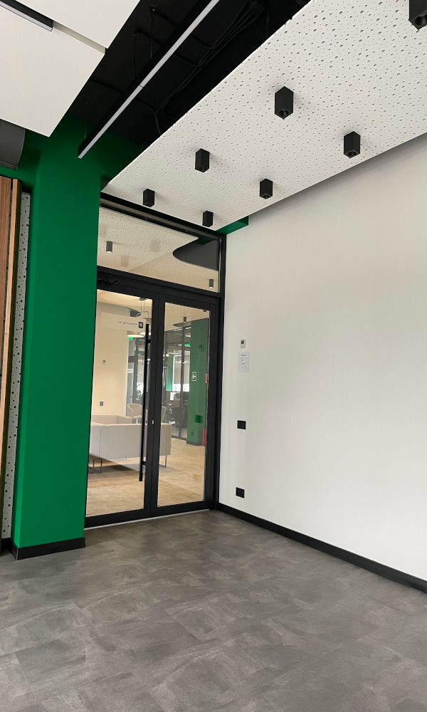
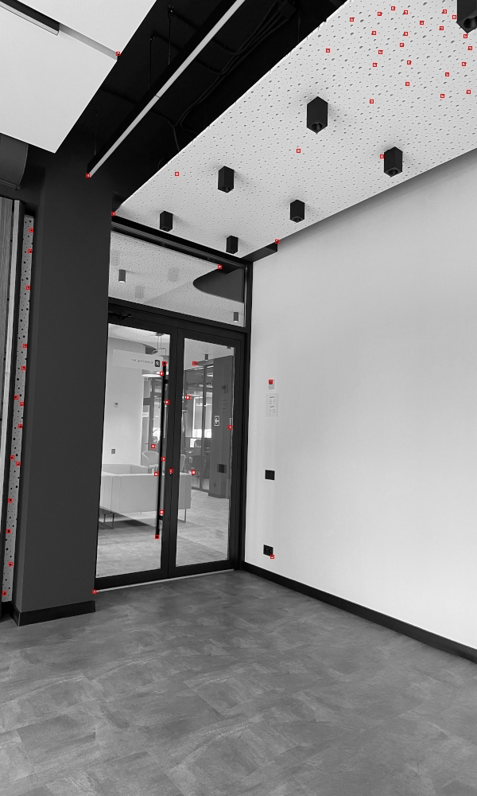
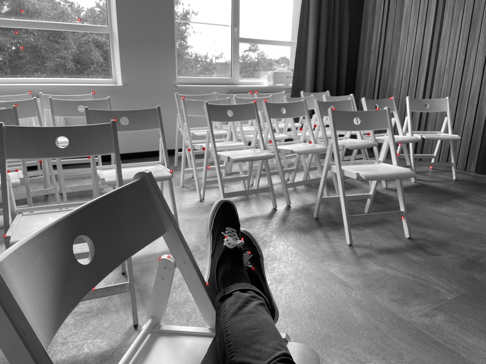

## go-fast

FAST corner detector implementation with Golang

### Deploy

```shell script
git clone https://github.com/peterdee/go-fast
cd ./go-fast
mkdir samples
mkdir results
gvm use 1.20
```

### Launch

Modify `main.go` file

```go
// point radius (used for NMS clustering)
const RADIUS int = 15

// path to image file
const SAMPLE string = "samples/image.png"

// if result should be saved as grayscale
const SAVE_GRAYSCALE bool = false

// threshold for corner point determination
const THRESHOLD uint8 = 150
```

Run the code

```go
go run ./
```

Output file will be placed in `results` directory

### Non Maximum Suppression

NMS is based on https://github.com/peterdee/js-nms with slight modifications.

NMS is used to group points into clusters based on `RADIUS` distance, and then the point with highest intensity difference is selected.

Current NMS implementation has some limitations: it's possible that several points are going to found within the `RADIUS` distance (this is an edge case when selected points are located at the edge of the cluster). It is possible to resolve this issue with more iterations over NMS results, but this can affect the performance.

### Examples

#### Image 1

Original image



Processed with the following settings

```go
const RADIUS int = 25
const SAVE_GRAYSCALE bool = true
const THRESHOLD uint8 = 70
```



#### Image 2

Original image


Processed with the following settings

```go
const RADIUS int = 15
const SAVE_GRAYSCALE bool = true
const THRESHOLD uint8 = 90
```



### License

[MIT](LICENSE.md)
